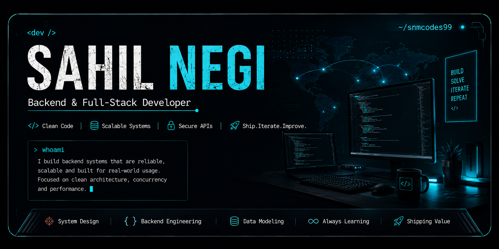

<div align="center">



<br/>


<br/><br/>


</div>

<br/>

<table width="100%">
<tr>
<td width="55%" valign="top">

## `> whoami`

**Backend & Full-Stack Developer** focused on building reliable systems with clean architecture, strong data modeling and practical API design.

Interested in the problems behind the API — **concurrency, scalability, distributed systems and system design.**

Currently deepening **PostgreSQL, system design and distributed systems**.

</td>

<td width="45%" valign="top">

## `> focus`

```text
BACKEND        ████████████████████
SYSTEM DESIGN  ████████████████░░░░
POSTGRESQL     ███████████████░░░░░
DISTRIBUTED    ██████████████░░░░░░
DSA            █████████████░░░░░░░
AWS            ███████████░░░░░░░░░
```

</td>
</tr>
</table>

---

## `> stack`

<div align="center">


<br/><br/>

<table>
<tr>
<td align="center"><b>BACKEND</b><br/>Node.js · Express · REST APIs</td>
<td align="center"><b>DATA</b><br/>MongoDB · PostgreSQL · Redis</td>
<td align="center"><b>INFRA</b><br/>Docker · AWS · GitHub Actions</td>
</tr>
</table>

</div>

---

## `> selected_work`

<table width="100%">
<tr>

<td width="50%" valign="top">

### `01 // MarketHub`

**Multi-vendor commerce backend**

Completed backend covering authentication, seller onboarding, catalog, orders and payments.

<br/>

`Node.js` `Express` `MongoDB`
`Redis` `Razorpay` `Docker`

<br/>

**Focus**

`RBAC` · `Data Modeling` · `Transactions` · `Caching`

</td>

<td width="50%" valign="top">

### `02 // EventFlow`

**Event management platform**

Backend-first system for scheduling, registration and capacity tracking across multi-session events.

<br/>

`Node.js` `Express` `MongoDB`
`REST APIs`

<br/>

**Focus**

`API Design` · `State Management` · `Capacity`

</td>

</tr>

<tr>

<td width="50%" valign="top">

### `03 // EV Charging Optimizer`

**Charging allocation & optimization**

Combines graph algorithms with optimization logic to distribute charging demand across stations.

<br/>

`C++` `FastAPI` `PostgreSQL`
`Node.js` `React`

<br/>

**Focus**

`Dijkstra` · `Graph Algorithms` · `Optimization`

</td>

<td width="50%" valign="top">

### `04 // Decentralized Voting`

**Verifiable voting system**

Explores secure vote recording by combining a conventional backend with blockchain technology.

<br/>

`Node.js` `Express` `MongoDB`
`Solidity` `Ethereum`

<br/>

**Focus**

`Integrity` · `Verification` · `Blockchain`

</td>

</tr>
</table>

---

## `> what_im_learning`

<div align="center">

<table width="90%">
<tr>
<td align="center" width="25%">

### `01`

**System Design**

Architecture
Scalability
Tradeoffs

</td>

<td align="center" width="25%">

### `02`

**PostgreSQL**

Relational Modeling
Query Optimization
Transactions

</td>

<td align="center" width="25%">

### `03`

**Distributed Systems**

Concurrency
Caching
Reliability

</td>

<td align="center" width="25%">

### `04`

**AWS**

Deployment
Infrastructure
Cloud Architecture

</td>
</tr>
</table>

</div>

---

## `> github_activity`

<div align="center">


</div>

---

## `> contributions`

<div align="center">

<picture>
  <source
    media="(prefers-color-scheme: dark)"
    srcset="https://raw.githubusercontent.com/snmcodes99/snmcodes99/output/github-snake-dark.svg"
  />
  <source
    media="(prefers-color-scheme: light)"
    srcset="https://raw.githubusercontent.com/snmcodes99/snmcodes99/output/github-snake.svg"
  />
  
</picture>

</div>

---

<div align="center">

## `> connect`

<a href="https://github.com/snmcodes99">

</a>
&nbsp;
<a href="https://linkedin.com/">

</a>

<br/><br/>

<sub>Open to backend engineering internships</sub>

<br/><br/>

<code>build → solve → iterate → ship</code>

<br/><br/>


</div>
